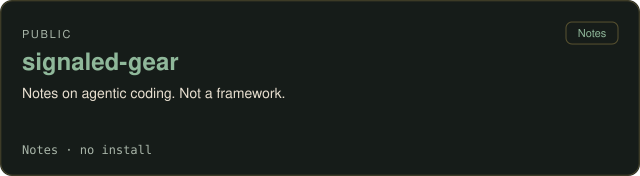
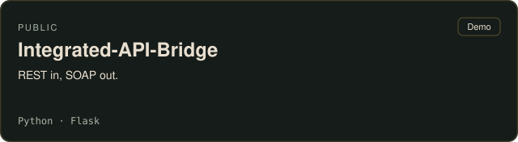
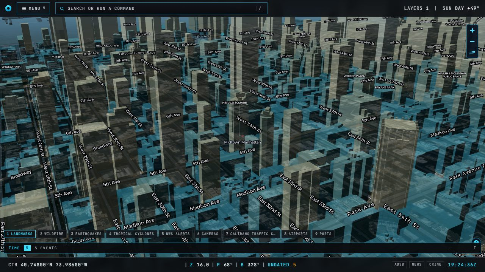
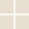
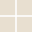

<!--
  Profile README for github.com/rustybladerunner
  Compact header borrowed from impossibletask.dev (nav + headline).
  Stack marks are one  each so title= works as a tooltip.
  Earthomicon is named; the repo is not public.
-->

  
  <strong>Impossible Task</strong>
  &nbsp;·&nbsp;
  <a href="https://impossibletask.dev">impossibletask.dev</a>
  &nbsp;·&nbsp;
  <a href="https://impossibletask.dev/#slate">Slate</a>
  &nbsp;·&nbsp;
  <a href="https://impossibletask.dev/#method">Method</a>

# A slate of systems in quiet production.

Local AI tooling, games, privacy apps, and desktop utilities.

## Public repos

<table>
<tr>
<td width="50%" valign="top">

### [vigilant-cogwheel](https://github.com/rustybladerunner/vigilant-cogwheel)

</td>
<td width="50%" valign="top">

### [alphalight](https://rustybladerunner.github.io/alphalight/)

</td>
</tr>
<tr>
<td width="50%" valign="top">

### [signaled-gear](https://github.com/rustybladerunner/signaled-gear)

</td>
<td width="50%" valign="top">

### [Integrated-API-Bridge](https://github.com/rustybladerunner/Integrated-API-Bridge)

</td>
</tr>
</table>

## Named, not public

### Earthomicon

A 3D globe of real terrain and buildings. Named on the site. Source is still private.

## Stack

**Languages**

     

**Web**

  

**Local inference**

    

**Frameworks**

     

**Maps**

**Data**

   

**Microsoft**

  

**Systems**

     

**Networking**

  

**Communications**

 

**On-site**

 

**Infra**

  

**Tools**

    
