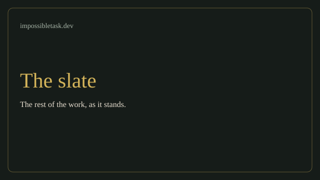

<!--
  Profile README for github.com/rustybladerunner
  Quiet, left-aligned, site palette (gold / sage / cream on green-black).
  Earthomicon is named; the repo is not public.
-->

# rustybladerunner

I build local tools, games, and utilities. Most of the work is not on GitHub.

[impossibletask.dev](https://impossibletask.dev)

## Public repos

<table>
<tr>
<td width="50%" valign="top">

### [vigilant-cogwheel](https://github.com/rustybladerunner/vigilant-cogwheel)

Local LoRA fine-tune. CLI, sample data, tests.

</td>
<td width="50%" valign="top">

### [alphalight](https://rustybladerunner.github.io/alphalight/)

10 Hz and 40 Hz. One HTML file.

</td>
</tr>
<tr>
<td width="50%" valign="top">

### [signaled-gear](https://github.com/rustybladerunner/signaled-gear)

Notes on agentic coding. Not a framework.

</td>
<td width="50%" valign="top">

### [Integrated-API-Bridge](https://github.com/rustybladerunner/Integrated-API-Bridge)

REST in, SOAP out.

</td>
</tr>
</table>

## Named, not public

### Earthomicon

A 3D globe of real terrain and buildings. It has its name on [impossibletask.dev](https://impossibletask.dev). The source is still private.

## The rest

[impossibletask.dev](https://impossibletask.dev)

## Stack

**Languages**

**Web**

**Local inference**

**Frameworks**

**Maps**

**Data**

**Microsoft**

**Systems**

**Networking**

**Communications**

**On-site**

**Infra**

**Tools**

---

[impossibletask.dev](https://impossibletask.dev) · [GitHub](https://github.com/rustybladerunner) · [X](https://x.com/rustybladerunnr)
