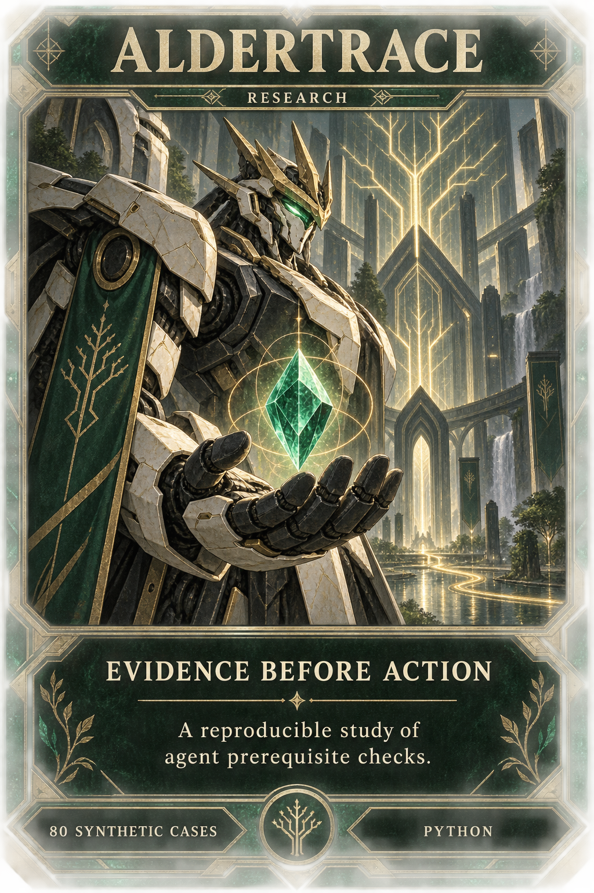
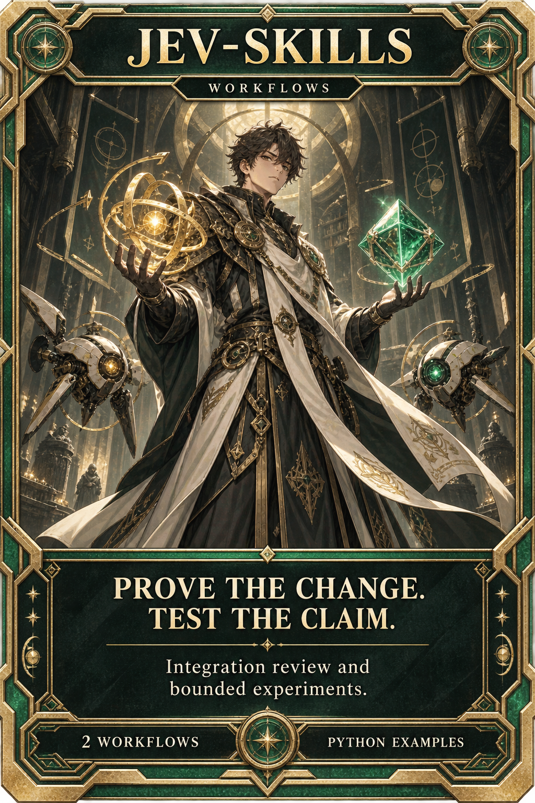
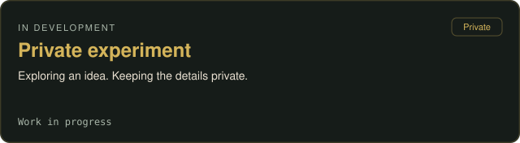
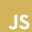
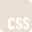
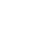
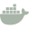

<!--
  Profile README for github.com/rustybladerunner
  The stack is one falling-column graphic, not a row of icons.
  Private work stays unnamed and intentionally nonspecific.
  Cards carry the title; the whole card is the link.
-->

# Local tools. Open experiments. Interactive worlds.

Selected public tools, experiments, and research.

## Project showcase

<table>
<tr>
<td width="33%" valign="top">

Routing overhead exceeded the reading avoided. Savings on completed coding tasks remain unproven.

<a href="https://github.com/rustybladerunner/aldertrace#start-here">Offline demo</a> · <a href="https://github.com/rustybladerunner/aldertrace#what-the-experiment-found">Results</a>

</td>
<td width="33%" valign="top">

Reusable agent workflows for reviewing integrations and running bounded experiments.

<a href="https://github.com/rustybladerunner/jev-skills#readme">Explore the workflows</a>

</td>
<td width="33%" valign="top">

Local LoRA fine-tuning workflow for Ministral-3B, with a CLI and sample data.

<a href="https://github.com/rustybladerunner/vigilant-cogwheel#readme">Read the workflow</a>

</td>
</tr>
</table>

Earlier work · 7 projects

Earlier tools, demos, and research notes.

| Project | What it is |
| :--- | :--- |
| [alphalight](https://github.com/rustybladerunner/alphalight) | A small browser light experiment with 10 Hz and 40 Hz modes. |
| [signaled-gear](https://github.com/rustybladerunner/signaled-gear) | Personal research notes distilled from public talks on agentic coding. |
| [Integrated-API-Bridge](https://github.com/rustybladerunner/Integrated-API-Bridge) | A Flask / spyne demo connecting REST and SOAP services. |
| [improve](https://github.com/rustybladerunner/improve) | Have a strong model audit a codebase and write plans a cheaper model can execute. |
| [video2ascii](https://github.com/rustybladerunner/video2ascii) | WebGL React component that turns video into ASCII. |
| [scanopy](https://github.com/rustybladerunner/scanopy) | Network diagrams with a one-time setup. |
| [Oligarchy](https://github.com/rustybladerunner/Oligarchy) | Agent-harness experiments for running and testing Omarchy releases. |

## Behind the scenes

## Stack

<table>
<tr>
<td align="center" valign="top">

 
 
 
 
 
 
 
 

</td>
<td align="center" valign="top">

 
 
 
 
 
 
 

</td>
<td align="center" valign="top">

 
 
 
 
 
 

</td>
<td align="center" valign="top">

 
 
 
 
 
 
 

</td>
<td align="center" valign="top">

 
 
 
 
 
 
 

</td>
<td align="center" valign="top">

 
 
 
 
 
 

</td>
<td align="center" valign="top">

 
 
 
 
 
 
 
 
 
 

</td>
</tr>
</table>
